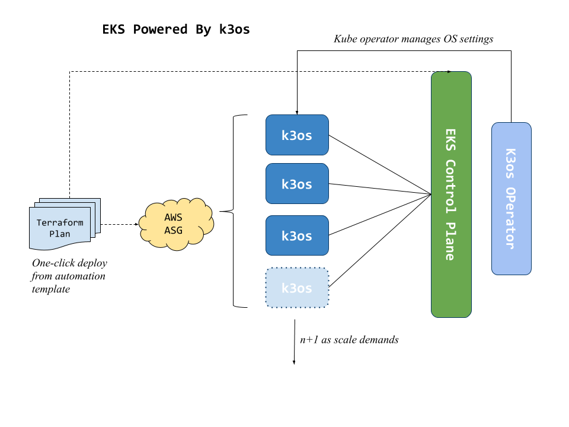

# k3eks
EKS Clusters Built with only whats required for fast and secure [Kubernetes](https://kubernetes.io) workloads

### Premise
[Amazon's EKS](https://aws.amazon.com/eks/) is great for handling the Kuberentes control plane & etcd, but it leaves some of the complexity of managing the Kubernetes nodes to the user. _Why not incorporate the management of the nodes themsleves back into the Kubernetes abstraction?_

By using the cloud native design of [k3os](https://k3os.io/) and coupling it with [Terraform](https://www.terraform.io/) and [ASGs](https://docs.aws.amazon.com/autoscaling/ec2/userguide/AutoScalingGroup.html), we can decrease the "state" of our server layer and shift our complexity up to the Kubernetes layer. This essentially makes EKS as turn-key and fully managed as Azure's AKS and Google's GKE. 

### Design

